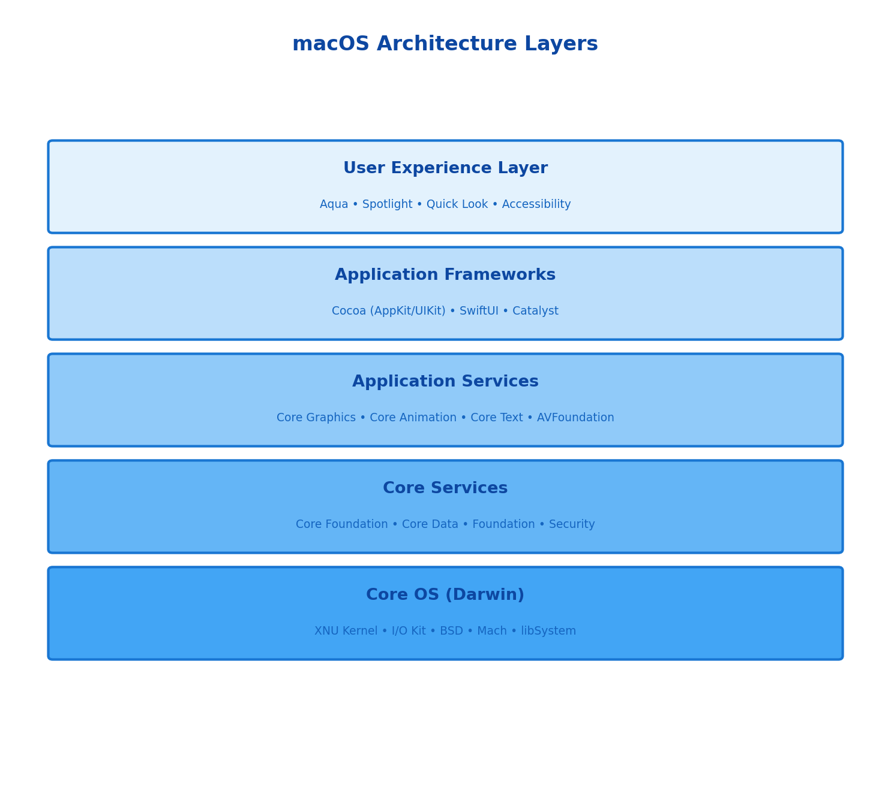
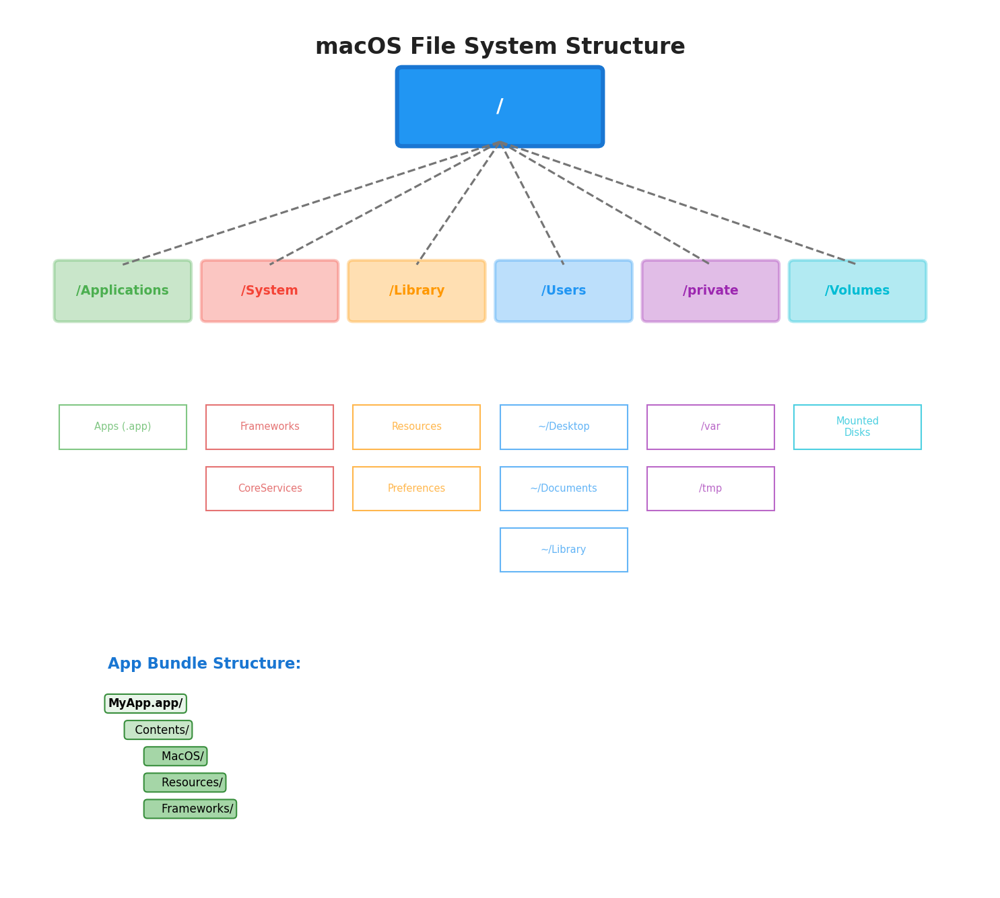
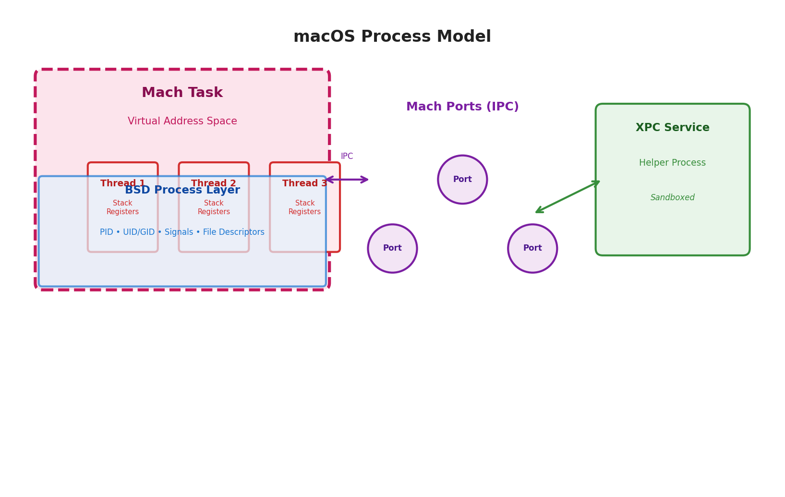
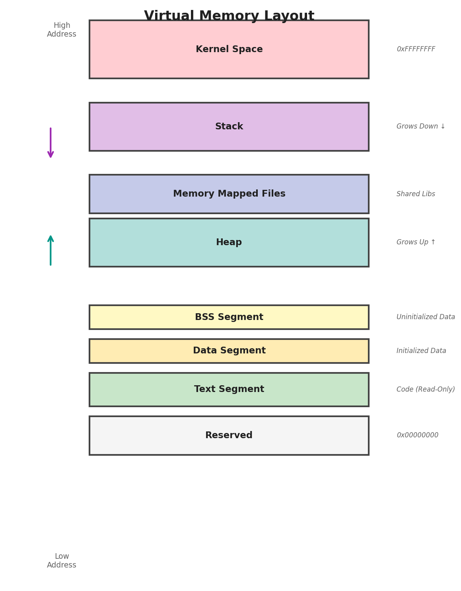

# Complete macOS Developer's Guide

## _Understanding macOS Architecture and System Programming_

---

## Table of Contents

1. [macOS Architecture Overview](#1-macos-architecture-overview)
2. [Development Frameworks](#2-development-frameworks)
3. [File System Architecture](#3-file-system-architecture)
4. [Process and Memory Management](#4-process-and-memory-management)
5. [Graphics and Display Systems](#5-graphics-and-display-systems)
6. [Security Architecture](#6-security-architecture)
7. [Development Best Practices](#7-development-best-practices)
8. [Summary and Resources](#8-summary-and-resources)

---

## 1. macOS Architecture Overview

macOS is a layered operating system built on Darwin, an open-source Unix-like foundation. Understanding this architecture is crucial for writing efficient, native macOS applications.

### 1.1 System Architecture Layers

macOS follows a layered architecture where each layer builds upon lower layers:



**Key Principle:** Higher layers provide abstraction and ease of use, while lower layers offer power and control. Choose the appropriate layer based on your application's needs.

### 1.2 Darwin and the XNU Kernel

Darwin combines the Mach microkernel with BSD Unix components, creating a hybrid kernel architecture called XNU (X is Not Unix).

| Component     | Description                                                                                                      |
| ------------- | ---------------------------------------------------------------------------------------------------------------- |
| **Mach**      | Provides low-level primitives: tasks, threads, ports, IPC, virtual memory management, and real-time scheduling   |
| **BSD**       | Provides POSIX compliance, file systems, networking stack, process model, signals, and user/group management     |
| **I/O Kit**   | Object-oriented device driver framework written in C++, provides dynamic loading of drivers and power management |
| **libSystem** | Core library combining libc, libm, libpthread, and other system libraries into a single dynamic library          |

---

## 2. Development Frameworks

### 2.1 Foundation Framework

Foundation provides essential data types, collections, and operating system services. It's the bedrock of macOS and iOS development.

**Core Foundation Classes:**

- **NSString / NSMutableString** - Unicode string handling with localization support
- **NSArray / NSMutableArray** - Ordered collections with KVC support
- **NSDictionary / NSMutableDictionary** - Key-value storage
- **NSData** - Binary data wrapper
- **NSDate / NSCalendar / NSDateFormatter** - Temporal data handling
- **NSURL / NSURLSession** - Network communication
- **NSFileManager** - File system operations
- **NSNotificationCenter** - Observer pattern implementation

---

## 3. File System Architecture

### 3.1 macOS Directory Structure

macOS uses a Unix-based directory hierarchy with additional macOS-specific conventions.



**Key Directories:**

- **`/Applications`** - User-installed applications (.app bundles)
- **`/System`** - System files, frameworks, and resources (read-only on APFS)
- **`/Library`** - System-wide application support files, preferences, and frameworks
- **`~/Library`** - User-specific application support, preferences, caches, and saved application state
- **`/Users`** - User home directories
- **`/private/var`** - Variable data: logs, temporary files, databases
- **`/private/tmp`** - Temporary files cleared on reboot
- **`/Volumes`** - Mounted filesystems and disk images

**App Bundle Structure:**

```text
MyApp.app/
  Contents/
    Info.plist          # App metadata, bundle ID, version
    MacOS/              # Executable binary
      MyApp
    Resources/          # Images, xibs, localized strings
      AppIcon.icns
      en.lproj/         # English localization
    Frameworks/         # Private frameworks
    PlugIns/            # App extensions
```

---

## 4. Process and Memory Management

### 4.1 Process Model

macOS uses a hybrid process model combining Mach tasks with BSD processes.



| Concept         | Description                                                                              |
| --------------- | ---------------------------------------------------------------------------------------- |
| **Mach Task**   | Container for resources: virtual address space, ports, threads, but no execution context |
| **Thread**      | Unit of execution with registers, stack, and scheduling state                            |
| **BSD Process** | POSIX process model with PID, UID, GID, signals, and file descriptors                    |
| **Port**        | Mach IPC endpoint for message-based communication between tasks                          |
| **XPC Service** | Lightweight helper process for privilege separation and stability                        |

### 4.2 Virtual Memory

macOS uses a sophisticated virtual memory system built on Mach VM.



**Memory Regions:**

- **Text Segment** - Read-only executable code
- **Data Segment** - Initialized global and static variables
- **BSS Segment** - Uninitialized global and static variables
- **Heap** - Dynamic memory allocation (grows upward)
- **Stack** - Function call frames (grows downward on x86_64, upward on ARM64)
- **Memory Mapped Files** - Files mapped into address space
- **Shared Libraries** - Framework code shared between processes

**Memory Pressure:** macOS monitors memory pressure and notifies apps via NSProcessInfo.processInfo.thermalState to reduce memory usage before swapping.

### 4.3 Automatic Reference Counting (ARC)

ARC is a compiler feature that automatically manages object lifetimes for Objective-C and Swift objects.

**ARC Ownership Qualifiers:**

- **strong** (default) - Creates an owning reference, retaining the object
- **weak** - Non-owning reference, becomes nil when object is deallocated
- **unowned** - Non-owning reference, crashes if accessed after deallocation
- **unsafe_unretained** - Non-owning reference, undefined if accessed after deallocation

**Retain Cycles:** Occur when two objects have strong references to each other. Break cycles using weak or unowned references, particularly in closures and delegates.

---

## 5. Graphics and Display Systems

### 5.1 Graphics Stack Architecture


The graphics stack consists of multiple layers:

1. **AppKit / SwiftUI / UIKit** - High-level UI frameworks
2. **Core Animation** - Layer-based composition and animation
3. **Core Graphics (Quartz 2D)** - 2D rendering engine
4. **Metal / OpenGL** - GPU acceleration APIs
5. **GPU Drivers & Hardware** - Hardware rendering

### 5.2 Core Graphics (Quartz 2D)

Core Graphics is the 2D rendering engine providing resolution-independent, anti-aliased graphics.

**Core Concepts:**

- **CGContext** - Drawing destination (screen, PDF, bitmap, printer)
- **Coordinate System** - User space coordinates, transformed via CTM
- **Paths** - Vector shapes built from lines, curves, and arcs
- **Color Spaces** - RGB, CMYK, Gray, calibrated color spaces
- **Transparency Layers** - Compositing with blend modes and alpha
- **PDF Generation** - Native PDF creation and rendering

### 5.3 Core Animation

Core Animation provides hardware-accelerated layer-based rendering and animation.

**Layer Hierarchy:**

- **CALayer** - Base layer class with position, bounds, transform, content
- **CAShapeLayer** - Vector shapes rendered using paths
- **CATextLayer** - Rendered text without creating views
- **CAGradientLayer** - Linear and radial gradients
- **CAScrollLayer** - Scrollable content regions

**Rendering Pipeline:** Layers are composited by the render server (WindowServer) running in a separate process, enabling smooth animations even when your app is busy.

### 5.4 Metal

Metal is Apple's modern GPU API providing low-overhead access to GPU hardware for graphics and compute.

**Metal Components:**

- **MTLDevice** - Represents the GPU hardware
- **MTLCommandQueue** - Submits command buffers to GPU
- **MTLCommandBuffer** - Contains encoded GPU commands
- **MTLRenderPipelineState** - Graphics pipeline configuration
- **Metal Shading Language** - C++-based GPU programming language

---

## 6. Security Architecture

### 6.1 App Sandbox

App Sandbox restricts application access to system resources, files, and network using entitlements.

**Common Entitlements:**

- **App Sandbox** - Enables sandboxing (required for Mac App Store)
- **Network Client** - Allows outbound network connections
- **Network Server** - Allows listening for inbound connections
- **File Access** - User Selected File, Downloads, Pictures, Music folders
- **Hardware** - Camera, Microphone, USB, Bluetooth, Printing

**Security-Scoped Bookmarks:** Allow persistent access to user-selected files across app launches without prompting again.

### 6.2 Code Signing and Notarization

All apps must be code signed. Apps distributed outside the Mac App Store must be notarized by Apple.

**Code Signing Process:**

1. Sign with Developer ID certificate from Apple
2. Include hardened runtime entitlements
3. Submit to Apple for automated security scan (notarization)
4. Staple notarization ticket to app bundle
5. Distribute app (Gatekeeper validates on first launch)

### 6.3 System Integrity Protection (SIP)

SIP prevents even root users from modifying protected system files and directories, including `/System`, `/usr` (except `/usr/local`), and `/bin`.

**Protected Operations:**

- Modifying system binaries and frameworks
- Loading unsigned kernel extensions (kexts deprecated)
- Debugging system processes
- Writing to protected locations

### 6.4 Privacy Permissions

macOS requires explicit user permission for accessing sensitive data and hardware.

**Privacy-Protected Resources:**

- Location Services (NSLocationWhenInUseUsageDescription)
- Contacts (NSContactsUsageDescription)
- Calendar, Reminders (NSCalendarsUsageDescription, NSRemindersUsageDescription)
- Photos (NSPhotoLibraryUsageDescription)
- Camera, Microphone (NSCameraUsageDescription, NSMicrophoneUsageDescription)
- Files in Documents, Downloads, Desktop (TCC prompts)
- Screen Recording, Accessibility (TCC prompts)

---

## 7. Development Best Practices

### 7.1 Memory Management

**Swift Value Semantics:**

- Structs and enums are copied (value types)
- Classes are referenced (reference types with ARC)
- Use structs for simple data, classes for complex objects with identity
- Break retain cycles with weak/unowned references in closures

**Memory Optimization:**

- Use `@autoreleasepool` for loops creating many temporary objects
- Release resources in response to memory warnings
- Use lazy loading for expensive resources
- Profile with Instruments' Allocations and Leaks tools

### 7.2 Grand Central Dispatch (GCD)

GCD provides a modern approach to concurrent programming using queues and blocks.

**Queue Types:**

- **Main Queue** - UI updates must run on main queue (serial)
- **Global Queue** - Background work with QoS levels (userInteractive, userInitiated, utility, background)
- **Custom Serial** - Synchronizing access to shared resources
- **Custom Concurrent** - Parallel processing of independent tasks

### 7.3 Performance Optimization

**Instruments Tools:**

- **Time Profiler** - Find CPU hotspots and inefficient algorithms
- **Allocations** - Track memory usage and identify leaks
- **Core Animation** - Diagnose rendering performance issues
- **System Trace** - Analyze system-level behavior and context switches
- **Energy Log** - Measure power consumption

**Rendering Performance:**

- Avoid opaque views for simpler compositing
- Rasterize complex layer trees (shouldRasterize)
- Use backing store for off-screen drawing
- Minimize layer count and avoid expensive effects

### 7.4 App Lifecycle

Understanding the app lifecycle helps you manage resources efficiently and provide good user experience.

**NSApplicationDelegate Methods:**

- `applicationWillFinishLaunching` - Early initialization
- `applicationDidFinishLaunching` - Complete initialization, show UI
- `applicationWillBecomeActive` - Prepare to interact with user
- `applicationDidBecomeActive` - App is frontmost
- `applicationWillResignActive` - Losing active status
- `applicationWillTerminate` - Save state, clean up resources

### 7.5 Modern Swift Concurrency

Swift 5.5+ introduces async/await and actors for safer concurrent programming.

**Key Features:**

- **async/await** - Structured concurrency with suspended execution
- **Actors** - Protect mutable state from data races at compile time
- **@MainActor** - Ensures code runs on main thread
- **Task groups** - Parallel execution of related work

**Async/Await:**

- async functions can suspend execution
- await keyword suspends until async function completes
- Task groups for parallel execution
- @MainActor ensures code runs on main thread

**Actors:**

- Reference types that protect mutable state
- Methods accessed via await to ensure synchronization
- Eliminate data races at compile time

---

## 8. Summary and Resources

### 8.1 Key Principles for macOS Development

- **Choose the Right Layer** - Use high-level frameworks (SwiftUI, AppKit) when possible, drop to lower levels only when necessary
- **Embrace Sandboxing** - Design for App Sandbox from the start using proper entitlements
- **Manage Memory Wisely** - Understand ARC, avoid retain cycles, use value types appropriately
- **Concurrency Done Right** - Use async/await, actors, or GCD appropriately; never block the main thread
- **Security First** - Code sign, notarize, request minimal permissions, respect user privacy
- **Profile and Optimize** - Use Instruments to find performance issues before users do
- **Integrate with System** - Implement extensions, Spotlight indexing, and user notifications for seamless UX
- **Follow HIG** - Adhere to macOS Human Interface Guidelines for consistent, native-feeling apps

### 8.2 Essential Resources

**Official Documentation:**

- Apple Developer Documentation - developer.apple.com/documentation
- macOS Human Interface Guidelines
- WWDC Videos - developer.apple.com/videos
- App Sandbox Design Guide
- Swift Programming Language Guide

**System Tools:**

- Xcode - IDE and debugger
- Instruments - Performance profiling
- Console.app - System logs and diagnostics
- Activity Monitor - Process and resource monitoring
- codesign, productbuild - Code signing tools

---

_This guide covers the essential architecture and programming concepts for macOS. Continue learning by building projects, reading Apple's documentation, and exploring WWDC sessions._
